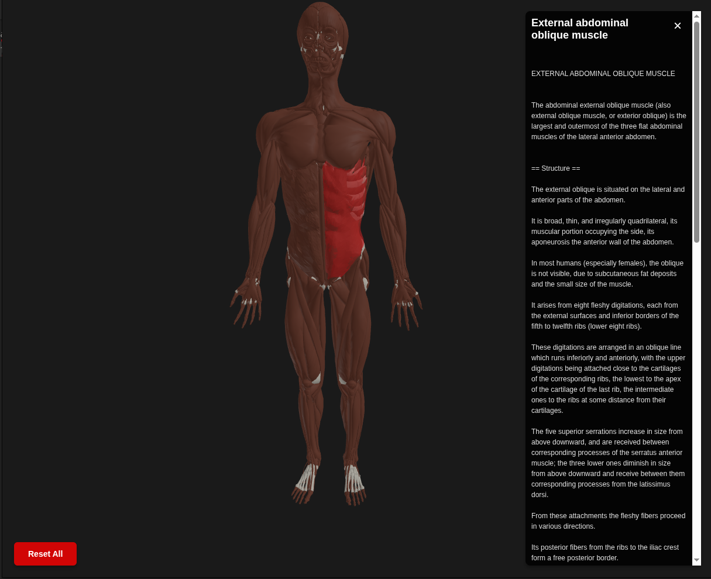

# Body Anatomy 3D Viewer

An interactive 3D anatomy viewer built with Three.js. I created this because I needed a browser-optimized anatomical model for other projects and couldn't find anything suitable. The main asset here is `body.glb` - a lightweight 3D model derived from the Z-Anatomy dataset and optimized for web use. The included viewer demonstrates how to load and interact with the model in a browser.



## Why This Exists

Most anatomical 3D models are either too large for browser rendering or lack the detail needed for educational purposes. I processed the comprehensive Z-Anatomy dataset with Python scripts in Blender to create a model that's both detailed and performant in browsers. This viewer shows how to use it, but the real value is the model itself - you can integrate it into any Three.js project.

## Features

- **Click-Through Layered Meshes**: Click on any anatomical structure (muscles, bones) to explore underlying layers
- **Visual Feedback**: Subtle red emissive glow for highlighted objects with smooth transitions
- **Smart Layer Navigation**: Click highlighted objects to move them away and reveal deeper structures
- **Intelligent Restore**: Clicking moved objects restores them along with any hidden underlying structures
- **Type Filters**: Toggle muscles and bones visibility independently - hidden objects move to floor piles
- **Smooth Animations**: Constant-speed curved animations using CatmullRom splines
- **Orbit Controls**: Intuitive camera navigation - click and drag to rotate, scroll to zoom
- **Rich Info Panel**: Displays anatomical names, descriptions, and educational wiki links
- **XYZ Axes Helper**: Toggle coordinate axes display (X=red, Y=green, Z=blue) for spatial reference
- **Reset Functionality**: One-click button to restore all objects to their original state
- **DRACO Compression**: Efficient 3D model loading with optimized file size
- **WebGL Rendering**: Hardware-accelerated graphics for smooth performance

## Demo

Visit the live demo at: [https://www.hpfreilabs.com/body-anatomy-3d-viewer/](https://www.hpfreilabs.com/body-anatomy-3d-viewer/)

## Quick Start

1. Clone this repository:
   ```bash
   git clone https://github.com/hpfrei/body-anatomy-3d-viewer.git
   cd body-anatomy-3d-viewer
   ```

2. Start a local server:
   ```bash
   npx serve -s public -l 3000
   ```

   This uses [serve](https://www.npmjs.com/package/serve) to host the static files. No installation required - npx downloads it temporarily.

3. Open your browser and navigate to:
   ```
   http://localhost:3000
   ```

**Alternative:** You can use any static file server - Python's `http.server`, VS Code Live Server, etc. Just serve the `public/` directory.

## Usage

### Basic Interactions

- **Rotate**: Left-click and drag to rotate the camera around the model
- **Zoom**: Scroll up/down to zoom in/out
- **Pan**: Right-click and drag to pan the camera
- **Select Object**: Left-click on any mesh to highlight it and view info
- **Move Away**: Click highlighted object again to move it to its pile on the floor
- **Restore**: Click moved objects to restore them back to position
- **Toggle Muscles/Bones**: Hide/show muscles or bones independently (moves to floor piles)
- **Toggle Axes**: Show/hide XYZ coordinate axes for spatial reference
- **Reset All**: Restore all objects to their original positions

### Navigation Tips

- Click through multiple layers to explore deep anatomical structures
- Use the info panel to learn about each selected structure
- Combine rotation and zooming for detailed examination of specific areas

## The 3D Model (body.glb)

The core asset of this project is `body.glb` - a 6.9 MB anatomical model optimized for browser rendering. I created it by processing the massive Z-Anatomy dataset, which is too large for web use in its original form.

### How I Made It

The Z-Anatomy project provides incredibly detailed anatomical models, but they're designed for medical software, not browsers. I wrote Python scripts in Blender to:

- **Simplify geometry** while maintaining anatomical accuracy
- **Optimize mesh topology** for efficient rendering
- **Embed metadata** into each mesh (anatomical names, types, wiki links)
- **Apply DRACO compression** to reduce file size by ~70%

This process took the comprehensive Z-Anatomy dataset and made it practical for web applications. The result is a model that loads quickly, renders smoothly, and still contains enough detail for educational purposes.

### Metadata Structure

Each mesh includes structured data in its `userData` property:

```javascript
{
  type: "muscle",                    // Anatomical type (muscle, bone, organ, etc.)
  name: "Pectoralis Major",          // Common anatomical name
  nameDetail: "Clavicular Head Of Pectoralis Major Muscle",  // Detailed anatomical name
  wikiLink: "https://en.wikipedia.org/wiki/Pectoralis_major"  // Educational wiki link
}
```

This metadata is what enables the viewer to display anatomical information and educational links. You can use it in your own projects to build custom interfaces, search functionality, quizzes, etc.

## The Viewer Implementation

`viewer.js` is a minimal reference implementation (~440 lines) showing how to load and interact with `body.glb`. It demonstrates:

- Loading the model with DRACO decompression
- Setting up Three.js scene, camera, and lights
- Raycasting for object selection
- Reading and displaying mesh metadata
- Animating objects with Tween.js

The code is intentionally straightforward so you can understand how it works and adapt it for your needs. Feel free to fork this and build your own features - cross-sections, measurement tools, VR support, whatever fits your use case.

## Project Structure

```
body-anatomy-3d-viewer/
├── public/
│   ├── index.html          # Main HTML file
│   ├── style.css           # Styling for UI elements
│   ├── viewer.js           # Three.js viewer implementation (reference code)
│   ├── body.glb            # 3D anatomical model (DRACO compressed, 6.9 MB)
│   ├── libs/               # Bundled Three.js libraries
│   │   ├── three.module.js        # Three.js core library
│   │   ├── OrbitControls.js       # Camera controls
│   │   ├── GLTFLoader.js          # GLTF/GLB loader
│   │   ├── DRACOLoader.js         # DRACO compression support
│   │   ├── tween.js               # Animation library
│   │   └── draco/                 # DRACO decoder files
│   └── utils/
│       └── BufferGeometryUtils.js # Utility functions
├── README.md               # This file
├── LICENSE                 # CC-BY-SA-4.0 license
├── CONTRIBUTING.md         # Contribution guidelines
└── CHANGELOG.md            # Version history
```

## Technologies Used

- **[Three.js](https://threejs.org/)**: WebGL-based 3D graphics library
- **[Tween.js](https://github.com/tweenjs/tween.js/)**: JavaScript animation library for smooth transitions
- **[DRACO](https://google.github.io/draco/)**: 3D geometry compression library by Google
- **WebGL**: Hardware-accelerated 3D graphics rendering

All libraries are bundled locally in `public/libs/` - no CDN dependencies.

## Browser Support

- Chrome/Edge (recommended)
- Firefox
- Safari
- Any modern browser with WebGL support

## Performance

The model loads in 1-3 seconds on typical connections. DRACO decompression happens in the browser using WebAssembly, which adds a small initialization delay but significantly reduces download size.

## Using This In Your Project

The easiest way to integrate this into your own project:

1. Copy `body.glb` and the `libs/` directory
2. Use the initialization code from `viewer.js` as a starting point
3. Customize the interaction and UI to match your needs

The model works with any Three.js setup - you're not locked into my viewer implementation.

## Attribution

This project uses anatomical models from **[Z-Anatomy](https://www.z-anatomy.com/)**, licensed under [Creative Commons Attribution-ShareAlike 4.0 International (CC BY-SA 4.0)](http://creativecommons.org/licenses/by-sa/4.0/).

**Source**: https://www.z-anatomy.com/
**License**: CC BY-SA 4.0

## License

This project is licensed under the Creative Commons Attribution-ShareAlike 4.0 International License (CC BY-SA 4.0) - see the [LICENSE](LICENSE) file for details.

This license applies to both the code and the anatomical model, in compliance with the Z-Anatomy source material's licensing requirements.

## Contributing

Contributions are welcome! Please read [CONTRIBUTING.md](CONTRIBUTING.md) for details on the process for submitting pull requests.

## Author

**hpfrei**
- Website: [https://www.hpfreilabs.com](https://www.hpfreilabs.com)
- GitHub: [@hpfrei](https://github.com/hpfrei)

## Issues

If you encounter any issues or have questions, please file them in the [issue tracker](https://github.com/hpfrei/body-anatomy-3d-viewer/issues).

## Acknowledgments

- Z-Anatomy for providing the comprehensive anatomical dataset
- Three.js community for excellent documentation and examples
- DRACO compression by Google for efficient 3D model delivery
